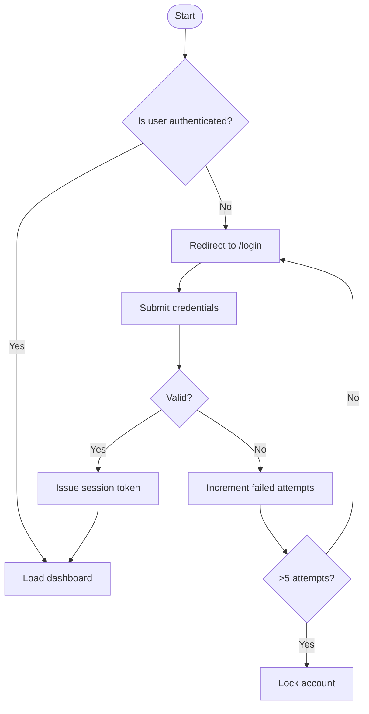
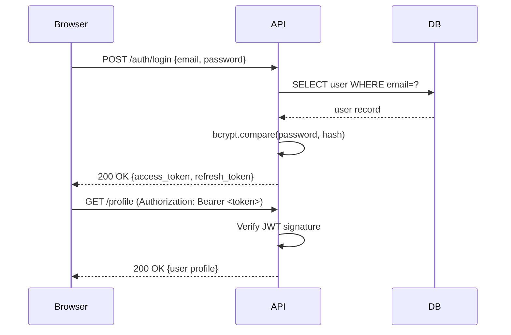
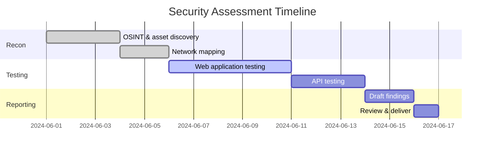
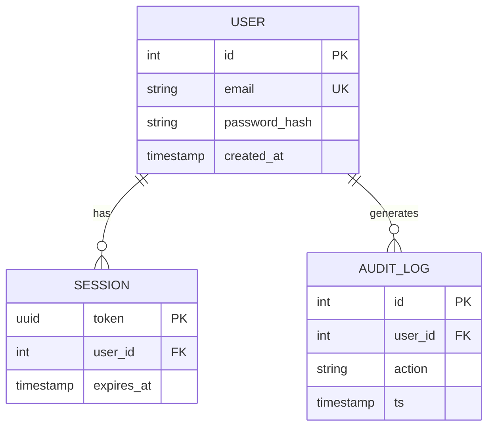

# GitHub Markdown: Complete Reference

<!-- Signed: Syed Ishaq B. | ishaqzafar.com -->

> **Jump to a section:**
> [Headings](#headings) · [Text Formatting](#text-formatting) · [Blockquotes & Alerts](#blockquotes--alerts) · [Code](#code) · [Tables](#tables) · [Lists](#lists--tree-structures) · [Links & Images](#links--images) · [Multi-Column Layout](#multi-column-layout) · [Collapsed Sections](#collapsed-sections) · [Diagrams](#mermaid-diagrams) · [Math](#math) · [Misc](#miscellaneous)

---

## Headings

```
# H1 — Page Title
## H2 — Section
### H3 — Subsection
#### H4 — Sub-subsection
##### H5 — Minor heading
###### H6 — Smallest heading
```

# H1 — Page Title
## H2 — Section
### H3 — Subsection
#### H4 — Sub-subsection
##### H5 — Minor heading
###### H6 — Smallest heading

**Alt syntax for H1/H2 (Setext style):**

```
H1 with underline
=================

H2 with underline
-----------------
```

---

## Text Formatting

| Syntax | Output |
|---|---|
| `**bold**` | **bold** |
| `*italic*` or `_italic_` | *italic* |
| `***bold italic***` | ***bold italic*** |
| `~~strikethrough~~` | ~~strikethrough~~ |
| `` `inline code` `` | `inline code` |
| `<sub>subscript</sub>` | H<sub>2</sub>O |
| `<sup>superscript</sup>` | E=mc<sup>2</sup> |
| `<kbd>Ctrl</kbd>+<kbd>C</kbd>` | <kbd>Ctrl</kbd>+<kbd>C</kbd> |
| `<mark>highlighted</mark>` | <mark>highlighted</mark> |

**Combining styles:**

This is ***bold and italic***, this is ~~**bold and struck**~~, and this is ***~~everything~~***.

---

## Blockquotes & Alerts

### Standard blockquotes

> A single-level blockquote.

> A multi-line blockquote.
> This is still the same quote.
>
> A new paragraph inside the quote.

> **Nested blockquotes:**
>
> > Level 2
> >
> > > Level 3 — going deep.

### GitHub Alerts (GFM extension)

> [!NOTE]
> Informational callout. Use for context that's helpful but not critical.

> [!TIP]
> Practical suggestions or shortcuts.

> [!IMPORTANT]
> Key information the reader must not miss.

> [!WARNING]
> Something could go wrong. Proceed with caution.

> [!CAUTION]
> Dangerous action. Risk of data loss, security breach, etc.

---

## Code

### Inline code

Use `git status` to check working tree state. Reference `CVE-2024-12345` inline.

### Fenced code blocks (with syntax highlighting)

```python
# Python example
def greet(name: str) -> str:
    return f"Hello, {name}!"

print(greet("World"))
```

```bash
#!/usr/bin/env bash
# Bash example
for file in /etc/cron.d/*; do
    echo "Checking: $file"
    stat "$file"
done
```

```json
{
  "name": "github-markdown-reference",
  "version": "1.0.0",
  "author": "Syed Ishaq B.",
  "tags": ["markdown", "github", "reference"]
}
```

```yaml
services:
  web:
    image: nginx:alpine
    ports:
      - "8080:80"
    volumes:
      - ./html:/usr/share/nginx/html:ro
```

```sql
SELECT u.username, COUNT(e.id) AS event_count
FROM users u
LEFT JOIN events e ON e.user_id = u.id
WHERE u.created_at > '2024-01-01'
GROUP BY u.username
ORDER BY event_count DESC
LIMIT 10;
```

### Diff blocks

```diff
- const apiUrl = "http://localhost:3000";
+ const apiUrl = process.env.API_URL ?? "https://api.example.com";

  function fetchData(endpoint) {
-   return fetch(apiUrl + endpoint);
+   return fetch(`${apiUrl}/${endpoint}`, { credentials: "include" });
  }
```

### No language (plain text / output)

```
$ nmap -sV -p 80,443 192.168.1.0/24
Starting Nmap 7.94 ...
Host: 192.168.1.1  Ports: 80/open/tcp/http/nginx 1.24
```

---

## Tables

### Basic table

| Column A | Column B | Column C |
|----------|----------|----------|
| Row 1    | Data     | More     |
| Row 2    | Data     | More     |

### Alignment

| Left-aligned | Center-aligned | Right-aligned |
|:-------------|:--------------:|--------------:|
| text         |     text       |          text |
| longer text  |  longer text   |   longer text |

### Table with inline formatting

| Tool | Version | Status | Notes |
|------|---------|--------|-------|
| `nmap` | 7.94 | ✅ Active | Port scanning |
| `burpsuite` | 2024.x | ✅ Active | Web proxy |
| `metasploit` | 6.x | ⚠️ Staging | Pentest only |
| ~~`nessus`~~ | — | ❌ Deprecated | Replaced by Tenable.io |

### Table with code and links

| Command | Description | Docs |
|---------|-------------|------|
| `git rebase -i HEAD~3` | Interactive rebase last 3 commits | [Git Book](https://git-scm.com/docs/git-rebase) |
| `git bisect start` | Binary search for a bad commit | [Git Book](https://git-scm.com/docs/git-bisect) |
| `git worktree add` | Multiple working trees | [Git Book](https://git-scm.com/docs/git-worktree) |

---

## Lists & Tree Structures

### Unordered list

- Item A
- Item B
  - Nested B1
  - Nested B2
    - Deep nested B2a
- Item C

### Ordered list

1. First step
2. Second step
   1. Sub-step 2a
   2. Sub-step 2b
3. Third step

### Mixed ordered + unordered (nested)

1. **Planning**
   - Define scope
   - Identify stakeholders
   - Set timeline
2. **Execution**
   - Development
     1. Write tests first
     2. Implement feature
     3. Code review
   - QA
     - Unit testing
     - Integration testing
3. **Release**
   - Deploy to staging
   - Smoke tests
   - Production rollout

### Task list (checkboxes)

- [x] Set up repository
- [x] Define branch strategy
- [ ] Write contributing guide
  - [x] Code style section
  - [ ] PR template
  - [ ] Review checklist
- [ ] Enable branch protection rules
- [ ] Configure CI/CD

### Hyperlinked nested list — tree command style

Mimics the output of `tree -L 3` using unicode box-drawing characters and mixed list types:

- 📂 [**project-root/**](https://github.com)
  - 📂 [`.github/`](https://github.com)
    - 📂 [`workflows/`](https://github.com)
      1. [`ci.yml`](https://github.com) — Lint, test, build
      2. [`release.yml`](https://github.com) — Semantic versioning + publish
    - [`CODEOWNERS`](https://github.com) — Auto-review assignment
    - [`pull_request_template.md`](https://github.com) — PR checklist
  - 📂 [`src/`](https://github.com)
    - 📂 [`components/`](https://github.com)
      - [`Header.tsx`](https://github.com)
      - [`Footer.tsx`](https://github.com)
      - [`Sidebar.tsx`](https://github.com)
    - 📂 [`hooks/`](https://github.com)
      1. [`useAuth.ts`](https://github.com) — Session management
      2. [`useFetch.ts`](https://github.com) — Data fetching abstraction
    - 📂 [`utils/`](https://github.com)
      - [`logger.ts`](https://github.com)
      - [`crypto.ts`](https://github.com)
      - [`validators.ts`](https://github.com)
    - [`main.tsx`](https://github.com) — Entry point
    - [`App.tsx`](https://github.com) — Root component
  - 📂 [`tests/`](https://github.com)
    - 📂 [`unit/`](https://github.com)
      1. [`auth.test.ts`](https://github.com)
      2. [`validators.test.ts`](https://github.com)
    - 📂 [`e2e/`](https://github.com)
      - [`login.spec.ts`](https://github.com)
      - [`checkout.spec.ts`](https://github.com)
  - 📂 [`docs/`](https://github.com)
    - 📄 [`architecture.md`](https://github.com)
    - 📄 [`api-reference.md`](https://github.com)
    - 📄 [`runbook.md`](https://github.com)
  - [`package.json`](https://github.com)
  - [`tsconfig.json`](https://github.com)
  - [`.env.example`](https://github.com)
  - [`README.md`](https://github.com)

---

## Links & Images

### Inline links

[OpenSSF Scorecard](https://securityscorecards.dev) — external link.

[Go to the Tables section](#tables) — anchor link within the same document.

### Reference-style links

Check the [GitHub Docs][gh-docs] and the [Markdown Spec][commonmark] for more detail.

[gh-docs]: https://docs.github.com
[commonmark]: https://spec.commonmark.org

### Autolink

https://github.com — bare URLs auto-link in GitHub Flavored Markdown.

### Images


### Linked image (clickable)

[](https://github.com)

### Image with size control (HTML)


### Badges (via shields.io)


---

## Multi-Column Layout

GitHub Markdown does not natively support columns, but HTML tables without visible borders work reliably.

### Two-column layout

<table>
<tr>
<td width="50%">

**Left Column**

Use this for documentation side-by-side, like input vs output, before vs after, or pros vs cons.

```python
# Before
data = json.loads(raw)
result = process(data)
```

</td>
<td width="50%">

**Right Column**

Any valid Markdown can go inside `<td>` blocks, including code, lists, and images.

```python
# After
result = process(json.loads(raw))
```

</td>
</tr>
</table>

### Three-column layout

<table>
<tr>
<td width="33%">

**Discovery**

- Asset inventory
- Port scanning
- Service enumeration

</td>
<td width="33%">

**Analysis**

- Vulnerability mapping
- Risk scoring (CVSS)
- Attack surface review

</td>
<td width="33%">

**Remediation**

- Patch prioritisation
- Configuration hardening
- Retesting & sign-off

</td>
</tr>
</table>

### Four-column feature grid

<table>
<tr>
<td align="center">

🔍

**Discover**

Scan and enumerate all exposed assets

</td>
<td align="center">

🧪

**Test**

Validate controls against known TTPs

</td>
<td align="center">

🛡️

**Harden**

Apply CIS benchmarks and least privilege

</td>
<td align="center">

📊

**Monitor**

Continuous alerting and anomaly detection

</td>
</tr>
</table>

---

## Collapsed Sections

<details>
<summary><strong>Click to expand: Full Nmap cheatsheet</strong></summary>

| Flag | Purpose |
|------|---------|
| `-sV` | Service/version detection |
| `-sC` | Default scripts |
| `-O` | OS detection |
| `-p-` | Scan all 65535 ports |
| `-T4` | Aggressive timing |
| `--open` | Show only open ports |
| `-oN` | Normal output to file |
| `-oA` | All formats (nmap/xml/gnmap) |

```bash
# Full aggressive scan with version detection
nmap -sV -sC -O -T4 -p- --open -oA scan_output 192.168.1.1
```

</details>

<details>
<summary>Click to expand: Environment variables reference</summary>

```bash
# AWS
export AWS_PROFILE=prod
export AWS_REGION=eu-west-1

# App
export LOG_LEVEL=info
export MAX_RETRIES=3
export TIMEOUT_MS=5000
```

</details>

<details open>
<summary><strong>This section starts expanded (details open)</strong></summary>

Use the `open` attribute on `<details>` to render the section expanded by default.
Useful for important content you don't want readers to miss.

</details>

---

## Footnotes

GitHub Markdown supports footnotes[^1] natively.

You can have multiple footnotes per document[^2], and the references render at the bottom automatically[^aws-note].

[^1]: This is the first footnote. It renders at the bottom of the document.
[^2]: Footnotes can contain **formatted text**, `code`, and even links like [this](https://github.com).
[^aws-note]: Named footnotes work too. Label them with anything alphanumeric.

---

## Mermaid Diagrams

GitHub renders Mermaid natively inside fenced code blocks tagged `mermaid`.

### Flowchart



### Sequence diagram



### Gantt chart



### Entity Relationship



---

## Math

GitHub renders LaTeX math via MathJax.

### Inline math

The quadratic formula is $x = \frac{-b \pm \sqrt{b^2 - 4ac}}{2a}$ and entropy is $H = -\sum p(x) \log p(x)$.

### Block math (display mode)

$$
\text{CVSS Base Score} = \frac{\text{ISCBase} \times \text{Exploitability} \times f(\text{Impact})}{10}
$$

$$
P(A \mid B) = \frac{P(B \mid A) \cdot P(A)}{P(B)}
$$

---

## Miscellaneous

### Horizontal rules

Three ways, all identical output:

---

***

___

### Emoji

Use GitHub shortcodes or paste Unicode directly.

| Shortcode | Rendered | Shortcode | Rendered |
|-----------|----------|-----------|----------|
| `:white_check_mark:` | ✅ | `:warning:` | ⚠️ |
| `:x:` | ❌ | `:fire:` | 🔥 |
| `:rocket:` | 🚀 | `:lock:` | 🔒 |
| `:mag:` | 🔍 | `:bug:` | 🐛 |
| `:book:` | 📖 | `:shield:` | 🛡️ |

### HTML passthrough elements

GitHub allows a subset of HTML tags inline:

- Line break: first line<br>second line
- Non-breaking space: word&nbsp;word (prevents wrapping)
- Centered content: <div align="center">**Centered block**</div>
- Abbreviation with tooltip: <abbr title="Transport Layer Security">TLS</abbr>

### Comment (invisible in rendered output)

```html
<!-- This comment is invisible in the rendered GitHub page -->
```

<!-- This is an actual invisible comment in this document -->

### Escaping special characters

Use a backslash to escape: \*not italic\*, \`not code\`, \[not a link\], \# not a heading.

### Definition-list style (using bold + line break)

**Threat Model**
A structured representation of all information that affects the security of an application.

**Attack Surface**
The sum of all the different points where an attacker can try to enter data or extract data.

**Blast Radius**
The extent of damage that would result from a security incident in a given system.

---

## Quick Reference Card

| Element | Syntax |
|---------|--------|
| Heading | `# H1` through `###### H6` |
| Bold | `**text**` |
| Italic | `*text*` |
| Bold italic | `***text***` |
| Strikethrough | `~~text~~` |
| Inline code | `` `code` `` |
| Code block | ```` ``` lang ```` |
| Link | `[label](url)` |
| Anchor link | `[label](#heading-id)` |
| Image | `` |
| Blockquote | `> text` |
| Note alert | `> [!NOTE]` |
| Warning alert | `> [!WARNING]` |
| Horizontal rule | `---` |
| Task | `- [ ]` / `- [x]` |
| Table | `\| col \| col \|` |
| Footnote | `[^1]` |
| Collapsed section | `<details><summary>` |
| Mermaid diagram | ```` ```mermaid ```` |
| Math inline | `$formula$` |
| Math block | `$$formula$$` |
| Subscript | `<sub>text</sub>` |
| Superscript | `<sup>text</sup>` |
| Keyboard key | `<kbd>Key</kbd>` |
| Emoji | `:shortcode:` or paste Unicode |
| Two columns | HTML `<table>` with `<td>` |
| Comment | `<!-- invisible -->` |

---

<!-- sigi: U3llZCBJc2hhcSBCLiB8IGlzaGFxemFmYXIuY29t -->

*Generated reference · [ishaqzafar.com](https://ishaqzafar.com)*
